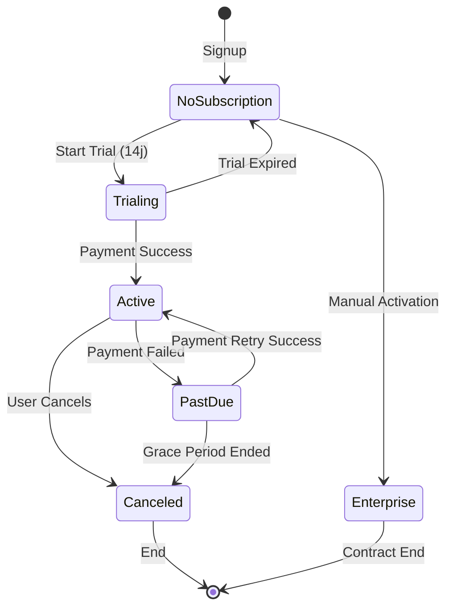
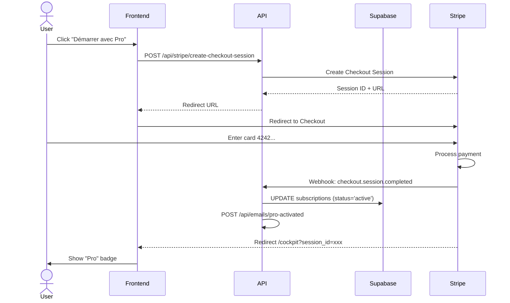

# 🎯 Architecture Pricing Pro/Entreprise - Vue d'ensemble

## Flux de données et composants

### 📦 Composants Frontend

1. **Page /pricing** (`app/pricing/page.tsx`)
   - Affiche plans Pro et Entreprise
   - Toggle mensuel/annuel (29€ vs 24€)
   - Boutons CTA vers Stripe Checkout
   - Formulaire demande Entreprise

2. **Dashboard /cockpit**
   - Affiche badge subscription (Pro, Entreprise, Trial)
   - Points d'accès aux fonctionnalités Pro

### 🛡️ Middleware Protection

**middleware-subscription.ts** (à activer)
- Intercepte toutes les requêtes
- Vérifie JWT token
- Query subscriptions table
- Routes protégées:
  - `/cockpit/projets`
  - `/cockpit/risques`
  - `/cockpit/decisions`
  - `/cockpit/gantt`
  - `/cockpit/kanban`
  - `/cockpit/ia`
  - Etc.
- Si pas d'abonnement → redirect `/pricing`

### 🔌 API Routes

#### Subscriptions
```
GET  /api/subscriptions/check
     → Vérifier statut subscription utilisateur
     
POST /api/subscriptions/start-trial
     → Démarrer essai gratuit 14 jours
     
POST /api/subscriptions/request-enterprise
     → Demande de devis Entreprise
```

#### Stripe
```
POST /api/stripe/create-checkout-session
     → Créer session paiement Stripe
     
POST /api/stripe/webhook
     → Recevoir événements Stripe (auto-activation)
     
POST /api/stripe/create-portal-session
     → Portail gestion abonnement
```

#### Emails (5 templates)
```
POST /api/emails/trial-started
POST /api/emails/pro-activated
POST /api/emails/trial-reminder
POST /api/emails/enterprise-request
POST /api/emails/admin-enterprise-notification
```

### 💾 Base de Données Supabase

#### Table: subscriptions
```sql
- id (uuid, PK)
- user_id (uuid, FK → profiles)
- plan (enum: 'trial' | 'pro' | 'enterprise')
- status (enum: 'trialing' | 'active' | 'past_due' | 'canceled')
- billing_interval ('monthly' | 'yearly')
- price_monthly (numeric)
- price_yearly (numeric)
- trial_start, trial_end (timestamp)
- current_period_start, current_period_end (timestamp)
- stripe_customer_id, stripe_subscription_id (text)
- canceled_at (timestamp)
- RLS: user_id = auth.uid()
```

#### Table: subscription_features
```sql
- id (uuid, PK)
- plan (enum: 'pro' | 'enterprise')
- feature_key (text, unique)
- feature_name (text)
- description (text)
- is_enabled (boolean)
- Seed data: 23 features (9 Pro + 14 Enterprise)
```

#### Table: enterprise_requests
```sql
- id (uuid, PK)
- email (text)
- full_name (text)
- company (text)
- phone (text)
- estimated_users (int)
- current_tools (text)
- governance_needs (text)
- message (text)
- user_id (uuid, nullable FK → profiles)
- status (enum: 'pending' | 'contacted' | 'converted' | 'rejected')
- RLS: Public insert, admin read
```

#### Triggers
```sql
-- sync_profile_subscription_status
-- Sync profiles.role ↔ subscriptions.status
```

### 🔌 Services Externes

#### Stripe
- **Produits à créer:**
  - Pro Mensuel: €29/mois (price_xxxxx)
  - Pro Annuel: €288/an soit €24/mois (price_yyyyy)
- **Webhooks**: 5 événements écoutés
  - checkout.session.completed → Activer subscription
  - customer.subscription.updated → Update status
  - customer.subscription.deleted → Cancel subscription
  - invoice.payment_failed → Set past_due
  - invoice.payment_succeeded → Set active

#### SendGrid/Resend (TODO)
- Remplacement console.log par vrais emails
- Templates transactionnels

---

## 🔄 Parcours utilisateur complets

### 1️⃣ Trial Gratuit (14 jours)

```
User → /signup
       ↓
    Création compte
       ↓
    POST /api/subscriptions/start-trial
       ↓
    INSERT INTO subscriptions (
      plan: 'pro',
      status: 'trialing',
      trial_end: NOW() + 14 days
    )
       ↓
    Email: trial-started
       ↓
    Redirect /cockpit
       ↓
    Badge "Trial - 14j restants"
       ↓
    Accès complet pendant 14j
       ↓
    J-3: Email trial-reminder
       ↓
    J-14: Auto-redirect /pricing
```

### 2️⃣ Upgrade Pro (Paiement)

```
User → /pricing
       ↓
    Click "Démarrer avec Pro"
       ↓
    POST /api/stripe/create-checkout-session
       ↓
    Redirect Stripe Checkout
       ↓
    User paie 29€ (carte test: 4242...)
       ↓
    Stripe → webhook: checkout.session.completed
       ↓
    POST /api/stripe/webhook
       ↓
    UPDATE subscriptions SET
      status = 'active',
      stripe_customer_id = 'cus_xxx',
      stripe_subscription_id = 'sub_xxx'
       ↓
    Email: pro-activated
       ↓
    Redirect /cockpit
       ↓
    Badge "Pro"
       ↓
    Accès permanent illimité
```

### 3️⃣ Demande Entreprise

```
Visiteur → /pricing
           ↓
       Scroll plan Entreprise
           ↓
       Click "Demander un devis"
           ↓
       Fill form (8 champs)
           ↓
       Submit → POST /api/subscriptions/request-enterprise
           ↓
       INSERT INTO enterprise_requests
           ↓
       Email 1: enterprise-request (user)
           ↓
       Email 2: admin-enterprise-notification
           ↓
       Message confirmation "Nous vous recontacterons"
           ↓
       [Admin: Contact manuel + création subscription]
```

### 4️⃣ Protection Routes (Middleware actif)

```
User sans subscription → /cockpit/projets
                          ↓
                     Middleware intercept
                          ↓
                     GET /api/subscriptions/check
                          ↓
                     Query subscriptions table
                          ↓
                     hasSubscription = false
                          ↓
                     Redirect /pricing?upgrade=required&from=/cockpit/projets
                          ↓
                     Message: "Votre essai est terminé"
```

---

## 🎯 États de subscription



---

## 📊 Diagramme de séquence: Paiement Stripe



---

## 🧩 Dépendances entre composants

### Pour /pricing fonctionne:
- ✅ Page déployée
- ✅ Formulaire Entreprise déployé
- ⏳ Schema DB appliqué (subscriptions, enterprise_requests)
- ⏳ API request-enterprise opérationnelle

### Pour Trial fonctionne:
- ⏳ Schema DB appliqué (subscriptions table)
- ✅ API start-trial déployée
- ⏳ Middleware activé (optionnel pour trial)
- ⏳ Email trial-started (console.log OK, SendGrid TODO)

### Pour Paiement Stripe fonctionne:
- ⏳ Compte Stripe créé
- ⏳ Produits Stripe créés (2 Price IDs)
- ⏳ Env vars Vercel configurées (3 clés)
- ⏳ Webhook Stripe pointant vers /api/stripe/webhook
- ⏳ Schema DB appliqué (subscriptions table)
- ✅ API routes Stripe déployées

### Pour Protection Routes fonctionne:
- ⏳ Middleware activé (remplacer middleware.ts)
- ⏳ Schema DB appliqué
- ✅ API check subscription déployée
- ⏳ Rebuild + redeploy après activation middleware

---

## 🔧 Configuration requise

### Supabase Environment
```env
NEXT_PUBLIC_SUPABASE_URL=https://xxx.supabase.co
NEXT_PUBLIC_SUPABASE_ANON_KEY=xxx
SUPABASE_SERVICE_ROLE_KEY=xxx
```

### Stripe Environment (à ajouter)
```env
STRIPE_SECRET_KEY=sk_test_xxx (ou sk_live_xxx)
NEXT_PUBLIC_STRIPE_PUBLISHABLE_KEY=pk_test_xxx
STRIPE_WEBHOOK_SECRET=whsec_xxx
```

### Email Service (optionnel)
```env
SENDGRID_API_KEY=SG.xxx
# OU
RESEND_API_KEY=re_xxx
```

---

## 🚀 Ordre d'activation recommandé

1. **Phase 1: Base** (Aujourd'hui)
   ```
   ✅ Code déployé
   → Appliquer subscriptions-schema.sql
   → Tester /pricing + formulaire Entreprise
   ```

2. **Phase 2: Stripe Integration** (Cette semaine)
   ```
   → Créer compte Stripe
   → Créer produits
   → Configurer webhooks
   → Ajouter env vars
   → Tester avec carte test
   ```

3. **Phase 3: Protection** (Après tests Stripe)
   ```
   → Activer middleware-subscription.ts
   → Rebuild + redeploy
   → Tester protection routes
   ```

4. **Phase 4: Polish** (Avant lancement)
   ```
   → Intégrer SendGrid emails
   → Tests utilisateurs bêta
   → Monitoring dashboards
   → Documentation support client
   ```

---

## ✅ Checklist avant lancement public

### Technique
- [ ] Schema DB appliqué sur Supabase
- [ ] Stripe configuré (mode Live)
- [ ] Webhooks Stripe fonctionnels
- [ ] Middleware activé
- [ ] Emails réels (SendGrid)
- [ ] Tests paiement réussis
- [ ] Monitoring actif (Stripe + Supabase)

### Contenu
- [ ] Page /pricing finalisée
- [ ] FAQ complète
- [ ] CGV/CGU mises à jour
- [ ] Templates emails validés
- [ ] Documentation support client

### Business
- [ ] Tarifs validés (29€/24€)
- [ ] Process devis Entreprise défini
- [ ] Support client formé
- [ ] Plan communication prêt
- [ ] Métriques tracking configurées

---

**Architecture complète et prête à l'emploi. Suivez l'ordre d'activation recommandé pour un déploiement sans risque! 🚀**
