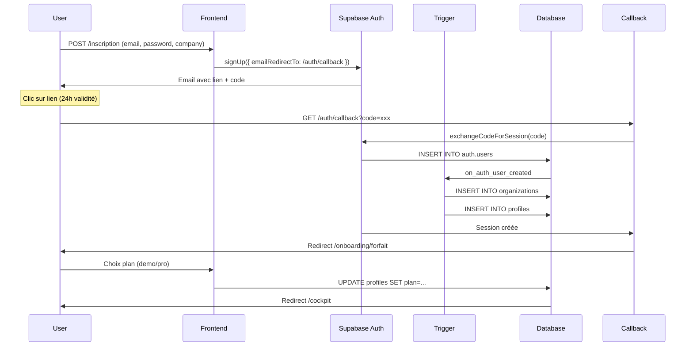

# 🎯 GUIDE COMPLET — FIX AUTH OTP_EXPIRED (SOLUTION FINALE)

## ✅ Ce qui a été fait dans le code

### 1. Route callback créée ✓
**Fichier** : `app/auth/callback/route.ts`
- Gère `exchangeCodeForSession()` (PKCE flow)
- Redirige vers `/onboarding/forfait` si succès
- Redirige vers `/auth/error` si échec avec détails

### 2. Page d'erreur créée ✓
**Fichier** : `app/auth/error/page.tsx`
- Affiche message d'erreur contextualisé
- Propose actions : nouvel compte ou login
- Détails techniques en accordéon
- Support accessible

### 3. emailRedirectTo corrigé ✓
**Fichiers modifiés** :
- `app/inscription/page.tsx` : `/auth/confirm` → `/auth/callback`
- `app/api/auth/signup/route.ts` : `/auth/confirm` → `/auth/callback`

### 4. Schema SQL onboarding ✓
**Fichier** : `database/schema-onboarding-complete.sql` (déjà existant)
- Trigger `handle_new_user()` pour auto-création org + profile
- Type enum `user_plan` (demo/pro/enterprise)
- RLS policies pour organizations et profiles

---

## 🔧 CONFIGURATION SUPABASE (À FAIRE MAINTENANT)

### Étape 1 : Redirect URLs
1. Aller sur https://supabase.com/dashboard
2. Sélectionner votre projet Powalyze
3. **Authentication** → **URL Configuration**
4. Dans **Redirect URLs**, ajouter (une par ligne) :
   ```
   https://www.powalyze.com/auth/callback
   https://powalyze.com/auth/callback
   http://localhost:3000/auth/callback
   https://www.powalyze.com
   https://powalyze.com
   http://localhost:3000
   ```

### Étape 2 : Site URL
Dans **Site URL**, mettre :
```
https://www.powalyze.com
```

### Étape 3 : Email Template
1. **Authentication** → **Email Templates** → **Confirm signup**
2. Vérifier que le template contient `{{ .ConfirmationURL }}`
3. ⚠️ **NE PAS** utiliser `{{ .Token }}` (expire en 1 min)

### Étape 4 : Enable Email Confirmation
1. **Authentication** → **Providers** → **Email**
2. Activer **Enable Email Confirmations**

### Étape 5 : Appliquer le trigger SQL
1. **SQL Editor** → **New query**
2. Copier/coller `database/schema-onboarding-complete.sql`
3. **Run** pour créer le trigger `handle_new_user()`
4. Vérifier dans **Database** → **Functions** que `handle_new_user` existe

---

## 🧪 FLUX DE TEST COMPLET

### A. Test Inscription (Email validation activée)

#### 1. Inscription
```
URL : https://www.powalyze.com/inscription

Actions :
- Remplir le formulaire (email, password, company)
- Cliquer "Créer mon compte Demo"
- Message : "Votre compte a été créé. Vérifiez votre boîte mail..."
- Redirection automatique vers /verification?email=...
```

#### 2. Email reçu
```
Sujet : "Confirm Your Signup"
Lien : https://www.powalyze.com/auth/callback?code=...

⚠️ IMPORTANT :
- Ouvrir l'email dans Gmail/Outlook WEB (pas l'app mobile)
- Cliquer sur le lien (ne pas copier/coller)
- Le lien expire en 24 heures
- Il ne peut être utilisé qu'une seule fois
```

#### 3. Callback & Confirmation
```
URL : /auth/callback?code=xxxxxxxxxxxxx

Traitement automatique :
1. Exchange code for session (exchangeCodeForSession)
2. Trigger handle_new_user() s'exécute :
   - Création organization (nom = company_name ou email)
   - Création profile (plan = demo, mode = admin)
3. Redirection vers /onboarding/forfait
```

#### 4. Choix du forfait
```
URL : /onboarding/forfait

Options :
- Mode Demo (gratuit) → /cockpit/demo
- Mode Pro → /cockpit/projets
- Enterprise (contact) → /contact?type=enterprise

Le choix update profiles.plan et profiles.pro_active
```

### B. Test en cas d'erreur

#### Erreur : "otp_expired"
```
Redirection vers : /auth/error?reason=otp_expired&message=...

Affiche :
- Icône rouge
- Message : "Le lien a expiré ou a déjà été utilisé"
- Bouton "Créer un nouveau compte"
- Bouton "Se connecter"

Solution :
1. Supprimer l'utilisateur dans Supabase → Auth → Users
2. Réessayer avec un nouvel email OU attendre 24h
```

#### Erreur : "missing_code"
```
Cause : URL /auth/callback sans paramètre ?code=

Solution : Copier l'URL complète depuis l'email
```

#### Erreur : "Invalid redirect URL"
```
Cause : /auth/callback pas dans la liste des Redirect URLs

Solution : Vérifier Étape 1 ci-dessus
```

---

## 🐛 TROUBLESHOOTING

### Problème 1 : Lien coupé dans l'email
**Symptômes** : URL incomplète, token tronqué
**Causes** : Client email (Gmail app, Outlook desktop) transforme l'URL
**Solutions** :
- Utiliser Gmail WEB : https://mail.google.com
- Utiliser Outlook WEB : https://outlook.office.com
- Copier l'URL complète dans la barre d'adresse
- Essayer un autre navigateur (Chrome, Firefox)

### Problème 2 : "Token already used"
**Symptômes** : Erreur après avoir cliqué plusieurs fois
**Cause** : Supabase invalide le token dès la première utilisation
**Solutions** :
- Ne pas recharger la page /auth/callback
- Ne pas cliquer plusieurs fois sur le lien
- Supprimer l'utilisateur dans Supabase et réessayer

### Problème 3 : Pas d'organization/profile créé
**Symptômes** : User existe dans auth.users mais pas de profile
**Cause** : Trigger `handle_new_user()` pas exécuté
**Solutions** :
1. Vérifier que le trigger existe :
   ```sql
   select * from pg_trigger where tgname = 'on_auth_user_created';
   ```
2. Vérifier les logs Supabase → Logs → Postgres
3. Exécuter manuellement :
   ```sql
   select handle_new_user() from auth.users where email = 'test@example.com';
   ```

### Problème 4 : RLS bloque l'accès après login
**Symptômes** : 403 Forbidden sur queries profiles/organizations
**Cause** : Policies RLS trop restrictives
**Solutions** :
1. Vérifier que le user a un profile :
   ```sql
   select * from profiles where id = auth.uid();
   ```
2. Vérifier que le profile a une organization_id :
   ```sql
   select organization_id from profiles where id = auth.uid();
   ```
3. Tester les policies :
   ```sql
   set role authenticated;
   set request.jwt.claims.sub to '<user_uuid>';
   select * from organizations;
   ```

---

## 📊 FLUX TECHNIQUE COMPLET



---

## ✅ CHECKLIST FINALE

### Configuration Supabase
- [ ] URLs ajoutées dans Auth → URL Configuration (6 URLs)
- [ ] Site URL configuré (https://www.powalyze.com)
- [ ] Email template vérifié (ConfirmationURL, pas Token)
- [ ] Enable Email Confirmations activé
- [ ] SQL trigger appliqué (schema-onboarding-complete.sql)
- [ ] Trigger vérifié dans Database → Functions

### Code déployé
- [ ] app/auth/callback/route.ts créé et déployé
- [ ] app/auth/error/page.tsx créé et déployé
- [ ] app/inscription/page.tsx corrigé (emailRedirectTo)
- [ ] app/api/auth/signup/route.ts corrigé (emailRedirectTo)
- [ ] Déploiement Vercel production réussi

### Tests
- [ ] Inscription avec nouvel email
- [ ] Email reçu avec lien correct /auth/callback
- [ ] Clic lien → Redirection /onboarding/forfait
- [ ] Organization créée automatiquement
- [ ] Profile créé automatiquement (plan=demo, mode=admin)
- [ ] Choix forfait → Redirection /cockpit
- [ ] Login fonctionne après inscription

---

## 🎯 RÉSUMÉ

**Avant** :
- emailRedirectTo pointait vers `/auth/confirm` (inexistant)
- Pas de gestion des erreurs
- Trigger auto-création manquant
- Lien expirait (confusion signUp vs signInWithOtp)

**Après** :
- ✅ Route `/auth/callback` avec PKCE exchange
- ✅ Page `/auth/error` avec messages contextualisés
- ✅ Trigger `handle_new_user()` pour org + profile auto
- ✅ `emailRedirectTo` corrigé partout
- ✅ Validité 24 heures (signUp avec password)

**Flux final** :
```
Inscription → Email (24h) → Clic lien → /auth/callback → Exchange code 
→ Trigger (org + profile) → Session → /onboarding/forfait → Choix plan → /cockpit
```

---

## 📞 SUPPORT

Si le problème persiste après cette configuration :

1. **Vérifier les logs Supabase** :
   - Logs → Auth
   - Logs → Postgres (pour voir trigger)

2. **Tester avec un nouvel email** :
   - Supprimer les comptes test dans Auth → Users
   - Utiliser un email jamais utilisé

3. **Vérifier le code du lien** :
   - Le paramètre `?code=` doit être présent
   - Le code doit faire ~40 caractères

4. **Documenter l'erreur exacte** :
   - URL complète
   - Message d'erreur
   - Screenshots des logs Supabase
