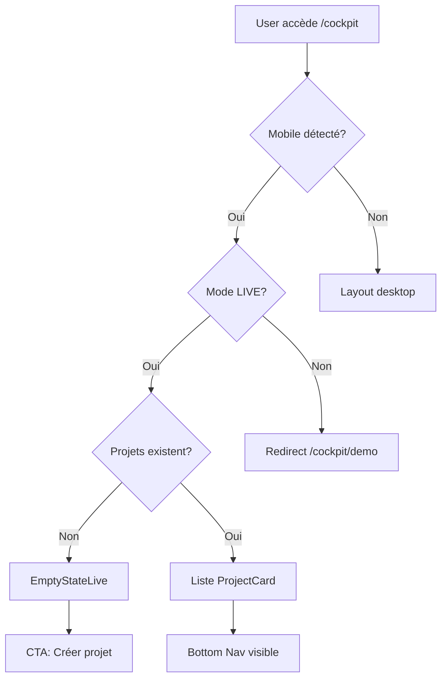
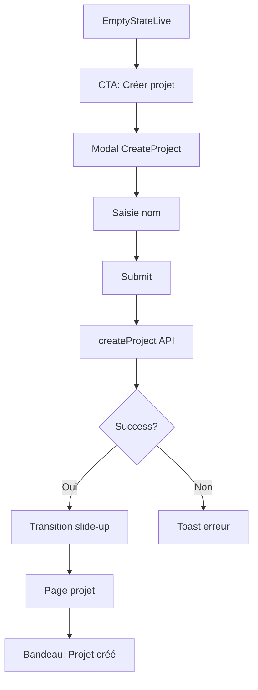
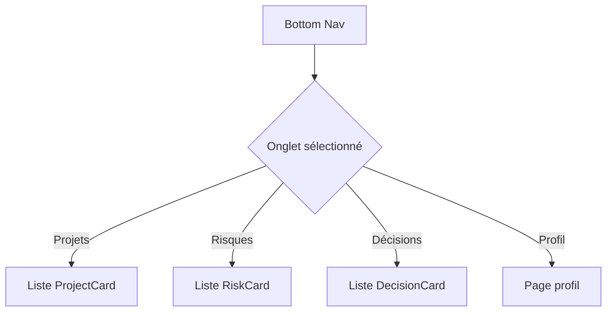
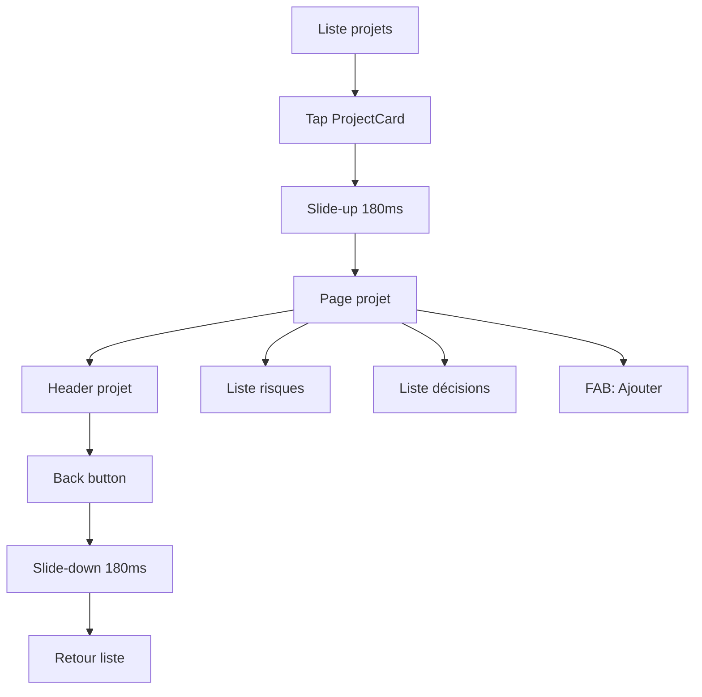
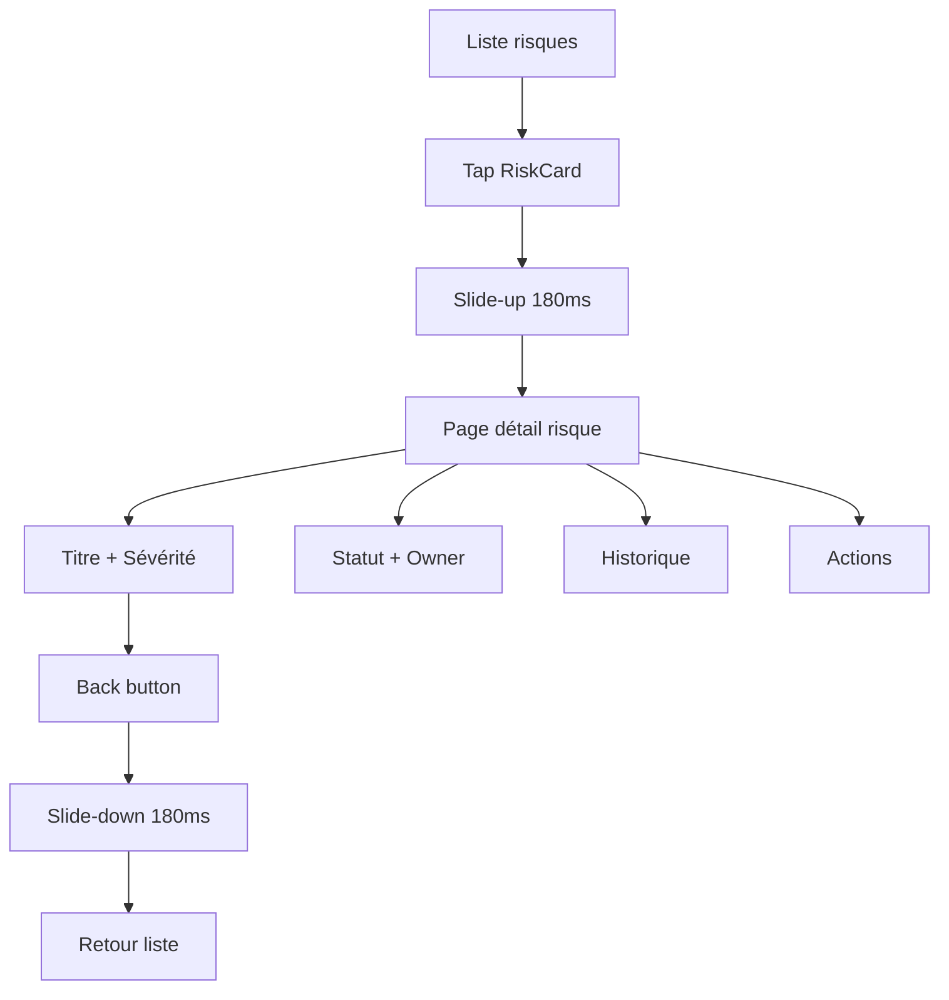

# PACK 6 — Mobile UX Specification

**Powalyze - Cockpit Mobile Experience (LIVE Only)**  
**Version** : 1.0.0  
**Date** : 29 janvier 2026  
**Status** : SPEC COMPLETE

---

## 🎯 OBJECTIF PACK 6

Définir l'expérience mobile complète du cockpit Powalyze (version LIVE uniquement).

Le cockpit mobile doit être :
- ✅ **Premium** : Design haut de gamme, cohérent avec PACK 4
- ✅ **Minimal** : Zéro surcharge visuelle, focus sur l'essentiel
- ✅ **Rapide** : Transitions 120-240ms, performances optimales
- ✅ **Clair** : Lisible d'un coup d'œil, hiérarchie visuelle nette
- ✅ **Orienté action** : Actions principales accessibles au pouce
- ✅ **Cohérent** : Parfaitement aligné avec Design System (PACK 4)

---

## 📱 PARTIE 1 — PRINCIPES FONDAMENTAUX

### Les 10 commandements du cockpit mobile

1. **App-native feel** : Le cockpit mobile est une **app**, pas un simple responsive
2. **LIVE only** : Activé **uniquement en mode LIVE** (pas en DEMO)
3. **Bottom navigation** : Navigation principale via **bottom bar** (4 onglets)
4. **Compact header** : Header minimaliste, lisible, sans surcharge
5. **Cartes plein écran** : Chaque carte lisible d'un coup d'œil
6. **Thumb-friendly** : Actions principales accessibles avec le pouce
7. **Fast transitions** : Animations légères, rapides, premium (120-240ms)
8. **No sidebar** : Aucune sidebar en mobile
9. **Visual clarity** : Aucune complexité visuelle, design épuré
10. **One-handed use** : Tout utilisable d'une seule main

---

## 🏗️ PARTIE 2 — STRUCTURE GLOBALE

### Architecture HTML

```html
<root class="mobile-cockpit">
  <header class="mobile-header">
    <!-- Titre + Sous-titre -->
  </header>
  
  <main class="mobile-main">
    <!-- Contenu dynamique (projets / risques / décisions / profil) -->
  </main>
  
  <nav class="mobile-bottom-nav">
    <!-- 4 onglets : Projets, Risques, Décisions, Profil -->
  </nav>
</root>
```

---

### HEADER (Compact)

**Dimensions** :
- Hauteur : `56px`
- Padding horizontal : `16px`
- Padding vertical : `12px`

**Contenu** :
```html
<header class="mobile-header">
  <div class="header-content">
    <h1 class="header-title">Powalyze</h1>
    <p class="header-subtitle">Cockpit exécutif</p>
  </div>
</header>
```

**Styles** :
```css
.mobile-header {
  height: 56px;
  padding: 12px 16px;
  background: #0A0A0A;
  border-bottom: 1px solid #1E1E1E;
  display: flex;
  align-items: center;
  position: sticky;
  top: 0;
  z-index: 100;
}

.header-title {
  font-size: 16px;
  font-weight: 600;
  color: #FFFFFF;
  line-height: 1.2;
  margin: 0;
}

.header-subtitle {
  font-size: 12px;
  color: #6A6A6A;
  line-height: 1.2;
  margin: 2px 0 0 0;
}
```

---

### MAIN (Contenu dynamique)

**Dimensions** :
- Height : `calc(100vh - 56px - 64px)` (full viewport - header - bottom nav)
- Padding horizontal : `16px`
- Padding vertical : `12px`
- Overflow : `scroll` (vertical only)

**Styles** :
```css
.mobile-main {
  height: calc(100vh - 56px - 64px);
  padding: 12px 16px;
  overflow-y: auto;
  overflow-x: hidden;
  background: #0A0A0A;
}

/* Smooth scrolling */
.mobile-main {
  scroll-behavior: smooth;
  -webkit-overflow-scrolling: touch;
}
```

**Contenu** :
- Liste de `ProjectCard` (onglet Projets)
- Liste de `RiskCard` (onglet Risques)
- Liste de `DecisionCard` (onglet Décisions)
- `EmptyStateLive` (si aucun projet)
- Détail projet / risque / décision (pages secondaires)

---

### BOTTOM NAV (Navigation principale)

**Dimensions** :
- Hauteur : `64px`
- Padding horizontal : `8px`

**Onglets** (4) :
1. **Projets** (icône : `Briefcase`)
2. **Risques** (icône : `AlertTriangle`)
3. **Décisions** (icône : `CheckSquare`)
4. **Profil** (icône : `User`)

**Structure** :
```html
<nav class="mobile-bottom-nav">
  <button class="nav-item active" data-tab="projects">
    <Briefcase size={24} />
    <span>Projets</span>
  </button>
  
  <button class="nav-item" data-tab="risks">
    <AlertTriangle size={24} />
    <span>Risques</span>
  </button>
  
  <button class="nav-item" data-tab="decisions">
    <CheckSquare size={24} />
    <span>Décisions</span>
  </button>
  
  <button class="nav-item" data-tab="profile">
    <User size={24} />
    <span>Profil</span>
  </button>
</nav>
```

**Styles** :
```css
.mobile-bottom-nav {
  height: 64px;
  padding: 8px;
  background: #0A0A0A;
  border-top: 1px solid #1E1E1E;
  display: flex;
  justify-content: space-around;
  align-items: center;
  position: fixed;
  bottom: 0;
  left: 0;
  right: 0;
  z-index: 100;
}

.nav-item {
  display: flex;
  flex-direction: column;
  align-items: center;
  gap: 4px;
  padding: 8px 12px;
  background: transparent;
  border: none;
  color: #6A6A6A;
  cursor: pointer;
  transition: all 120ms ease;
}

.nav-item svg {
  width: 24px;
  height: 24px;
}

.nav-item span {
  font-size: 11px;
  font-weight: 500;
  line-height: 1;
}

.nav-item.active {
  color: #3A82F7;
}

.nav-item:active {
  opacity: 0.9;
  transform: scale(0.98);
}
```

---

## 🎨 PARTIE 3 — COMPOSANTS MOBILES

### 1. ProjectCard (Mobile)

**Usage** : Liste de projets dans l'onglet "Projets"

**Dimensions** :
- Largeur : `100%`
- Hauteur : `88-120px` (auto selon contenu)
- Margin bottom : `12px`

**Layout** :
```
┌─────────────────────────────────────────┐
│ [Titre du projet]                       │ ← 16px blanc, bold
│ [Sous-titre / Date]                     │ ← 14px gris
│                                         │
│ 🔴 3 risques ouverts • 📋 2 décisions   │ ← 12px badges
└─────────────────────────────────────────┘
```

**Structure** :
```tsx
<div className="project-card-mobile" onClick={handleOpenProject}>
  <h3 className="project-title">{project.name}</h3>
  <p className="project-subtitle">{project.description || "Aucune description"}</p>
  
  <div className="project-stats">
    <span className="stat-badge">
      <AlertTriangle size={14} />
      {openRisksCount} risques ouverts
    </span>
    <span className="stat-badge">
      <CheckSquare size={14} />
      {pendingDecisionsCount} décisions
    </span>
  </div>
</div>
```

**Styles** :
```css
.project-card-mobile {
  width: 100%;
  padding: 16px;
  background: #111111;
  border: 1px solid #1E1E1E;
  border-radius: 12px;
  margin-bottom: 12px;
  cursor: pointer;
  transition: all 120ms ease;
}

.project-card-mobile:active {
  opacity: 0.9;
  transform: scale(0.99);
}

.project-title {
  font-size: 16px;
  font-weight: 600;
  color: #FFFFFF;
  margin: 0 0 4px 0;
  line-height: 1.3;
}

.project-subtitle {
  font-size: 14px;
  color: #6A6A6A;
  margin: 0 0 12px 0;
  line-height: 1.4;
}

.project-stats {
  display: flex;
  gap: 12px;
  flex-wrap: wrap;
}

.stat-badge {
  display: flex;
  align-items: center;
  gap: 4px;
  font-size: 12px;
  color: #9A9A9A;
}

.stat-badge svg {
  width: 14px;
  height: 14px;
}
```

**Interaction** :
- Tap → `handleOpenProject()` → slide-up vers page projet (180ms)
- Feedback tactile : opacity 90% pendant 80ms

---

### 2. RiskCard (Mobile)

**Usage** : Liste de risques dans l'onglet "Risques" ou dans un projet

**Dimensions** :
- Largeur : `100%`
- Hauteur : `72-96px`
- Margin bottom : `12px`

**Layout** :
```
┌─────────────────────────────────────────┐
│ [Titre du risque]                       │ ← 15px blanc
│ 🔴 Élevé • Ouvert                       │ ← 12px badges (sévérité + statut)
└─────────────────────────────────────────┘
```

**Structure** :
```tsx
<div className="risk-card-mobile" onClick={handleOpenRisk}>
  <h4 className="risk-title">{risk.title}</h4>
  
  <div className="risk-meta">
    <span className={`severity-badge ${risk.severity}`}>
      {risk.severity === 'HIGH' && '🔴'}
      {risk.severity === 'MEDIUM' && '🟡'}
      {risk.severity === 'LOW' && '🟢'}
      {getSeverityLabel(risk.severity)}
    </span>
    
    <span className="status-badge">{getStatusLabel(risk.status)}</span>
  </div>
</div>
```

**Styles** :
```css
.risk-card-mobile {
  width: 100%;
  padding: 12px 16px;
  background: #111111;
  border: 1px solid #1E1E1E;
  border-radius: 8px;
  margin-bottom: 12px;
  cursor: pointer;
  transition: all 120ms ease;
}

.risk-card-mobile:active {
  opacity: 0.9;
}

.risk-title {
  font-size: 15px;
  font-weight: 500;
  color: #FFFFFF;
  margin: 0 0 8px 0;
  line-height: 1.3;
}

.risk-meta {
  display: flex;
  gap: 8px;
  align-items: center;
}

.severity-badge {
  display: inline-flex;
  align-items: center;
  gap: 4px;
  padding: 4px 8px;
  font-size: 12px;
  border-radius: 4px;
  font-weight: 500;
}

.severity-badge.HIGH {
  background: rgba(239, 68, 68, 0.15);
  color: #EF4444;
}

.severity-badge.MEDIUM {
  background: rgba(251, 191, 36, 0.15);
  color: #FBBF24;
}

.severity-badge.LOW {
  background: rgba(34, 197, 94, 0.15);
  color: #22C55E;
}

.status-badge {
  font-size: 12px;
  color: #9A9A9A;
}
```

---

### 3. DecisionCard (Mobile)

**Usage** : Liste de décisions dans l'onglet "Décisions" ou dans un projet

**Dimensions** :
- Largeur : `100%`
- Hauteur : `72-96px`
- Margin bottom : `12px`

**Layout** :
```
┌─────────────────────────────────────────┐
│ [Titre de la décision]                  │ ← 15px blanc
│ 👤 John Doe • En attente                │ ← 12px owner + statut
└─────────────────────────────────────────┘
```

**Structure** :
```tsx
<div className="decision-card-mobile" onClick={handleOpenDecision}>
  <h4 className="decision-title">{decision.title}</h4>
  
  <div className="decision-meta">
    <span className="owner-badge">
      <User size={14} />
      {decision.owner || "Non assigné"}
    </span>
    
    <span className={`status-badge ${decision.status}`}>
      {getDecisionStatusLabel(decision.status)}
    </span>
  </div>
</div>
```

**Styles** :
```css
.decision-card-mobile {
  width: 100%;
  padding: 12px 16px;
  background: #111111;
  border: 1px solid #1E1E1E;
  border-radius: 8px;
  margin-bottom: 12px;
  cursor: pointer;
  transition: all 120ms ease;
}

.decision-card-mobile:active {
  opacity: 0.9;
}

.decision-title {
  font-size: 15px;
  font-weight: 500;
  color: #FFFFFF;
  margin: 0 0 8px 0;
  line-height: 1.3;
}

.decision-meta {
  display: flex;
  gap: 8px;
  align-items: center;
}

.owner-badge {
  display: inline-flex;
  align-items: center;
  gap: 4px;
  font-size: 12px;
  color: #9A9A9A;
}

.owner-badge svg {
  width: 14px;
  height: 14px;
}

.status-badge {
  font-size: 12px;
  padding: 4px 8px;
  border-radius: 4px;
  font-weight: 500;
}

.status-badge.PENDING {
  background: rgba(251, 191, 36, 0.15);
  color: #FBBF24;
}

.status-badge.APPROVED {
  background: rgba(34, 197, 94, 0.15);
  color: #22C55E;
}

.status-badge.REJECTED {
  background: rgba(239, 68, 68, 0.15);
  color: #EF4444;
}
```

---

### 4. EmptyStateLive (Mobile)

**Usage** : État vide quand aucun projet en mode LIVE

**Dimensions** :
- Largeur : `100%`
- Height : `calc(100vh - 56px - 64px)` (full viewport - header - nav)
- Display : `flex` centré verticalement

**Layout** :
```
        ┌─────────────────────────┐
        │                         │
        │    📊                   │ ← Icône 64px
        │                         │
        │  Commencez votre        │ ← Titre 20px blanc
        │  premier projet         │
        │                         │
        │  Créez un projet pour   │ ← Sous-titre 14px gris
        │  suivre vos portefeuilles│
        │                         │
        │  [Créer mon projet]     │ ← CTA button
        │                         │
        └─────────────────────────┘
```

**Structure** :
```tsx
<div className="empty-state-live-mobile">
  <div className="empty-content">
    <div className="empty-icon">
      <Briefcase size={64} strokeWidth={1} />
    </div>
    
    <h2 className="empty-title">Commencez votre premier projet</h2>
    <p className="empty-subtitle">
      Créez un projet pour suivre vos portefeuilles, risques et décisions
    </p>
    
    <button className="empty-cta" onClick={handleCreateProject}>
      Créer mon premier projet
    </button>
  </div>
</div>
```

**Styles** :
```css
.empty-state-live-mobile {
  display: flex;
  align-items: center;
  justify-content: center;
  min-height: calc(100vh - 56px - 64px);
  padding: 24px 16px;
}

.empty-content {
  text-align: center;
  max-width: 320px;
}

.empty-icon {
  color: #3A82F7;
  margin: 0 auto 24px;
  opacity: 0.8;
}

.empty-icon svg {
  width: 64px;
  height: 64px;
}

.empty-title {
  font-size: 20px;
  font-weight: 600;
  color: #FFFFFF;
  margin: 0 0 12px 0;
  line-height: 1.3;
}

.empty-subtitle {
  font-size: 14px;
  color: #6A6A6A;
  margin: 0 0 24px 0;
  line-height: 1.5;
}

.empty-cta {
  width: 100%;
  padding: 12px 24px;
  background: #FFFFFF;
  color: #0A0A0A;
  border: none;
  border-radius: 8px;
  font-size: 15px;
  font-weight: 600;
  cursor: pointer;
  transition: all 120ms ease;
}

.empty-cta:active {
  opacity: 0.9;
  transform: scale(0.98);
}
```

---

### 5. Modal (Mobile)

**Usage** : Création projet, édition, confirmations

**Animation** : Slide-up depuis le bas (240ms)

**Dimensions** :
- Largeur : `100%`
- Hauteur : `auto` (max 80vh)
- Border radius top : `16px`

**Structure** :
```tsx
<div className="modal-overlay" onClick={handleClose}>
  <div className="modal-mobile" onClick={(e) => e.stopPropagation()}>
    <div className="modal-handle"></div>
    
    <div className="modal-header">
      <h3 className="modal-title">{title}</h3>
      <button className="modal-close" onClick={handleClose}>
        <X size={24} />
      </button>
    </div>
    
    <div className="modal-content">
      {children}
    </div>
  </div>
</div>
```

**Styles** :
```css
.modal-overlay {
  position: fixed;
  inset: 0;
  background: rgba(0, 0, 0, 0.8);
  display: flex;
  align-items: flex-end;
  z-index: 1000;
  animation: fadeIn 240ms ease;
}

.modal-mobile {
  width: 100%;
  max-height: 80vh;
  background: #111111;
  border-radius: 16px 16px 0 0;
  overflow: hidden;
  animation: slideUp 240ms ease;
}

.modal-handle {
  width: 40px;
  height: 4px;
  background: #2A2A2A;
  border-radius: 2px;
  margin: 12px auto 0;
}

.modal-header {
  display: flex;
  justify-content: space-between;
  align-items: center;
  padding: 16px;
  border-bottom: 1px solid #1E1E1E;
}

.modal-title {
  font-size: 18px;
  font-weight: 600;
  color: #FFFFFF;
  margin: 0;
}

.modal-close {
  background: transparent;
  border: none;
  color: #6A6A6A;
  cursor: pointer;
  padding: 4px;
}

.modal-content {
  padding: 16px;
  overflow-y: auto;
  max-height: calc(80vh - 80px);
}

@keyframes fadeIn {
  from { opacity: 0; }
  to { opacity: 1; }
}

@keyframes slideUp {
  from { transform: translateY(100%); }
  to { transform: translateY(0); }
}
```

---

### 6. Drawer (Mobile)

**Usage** : Actions secondaires, menus contextuels

**Animation** : Slide-left ou slide-up (180ms)

**Dimensions** :
- Largeur : `80%` (slide-left) ou `100%` (slide-up)
- Hauteur : `100%` (slide-left) ou `auto` (slide-up)

**Structure** :
```tsx
<div className="drawer-overlay" onClick={handleClose}>
  <div className="drawer-mobile" onClick={(e) => e.stopPropagation()}>
    <div className="drawer-header">
      <h3 className="drawer-title">{title}</h3>
      <button className="drawer-close" onClick={handleClose}>
        <X size={24} />
      </button>
    </div>
    
    <div className="drawer-content">
      {children}
    </div>
  </div>
</div>
```

**Styles** :
```css
.drawer-overlay {
  position: fixed;
  inset: 0;
  background: rgba(0, 0, 0, 0.8);
  z-index: 1000;
  animation: fadeIn 180ms ease;
}

.drawer-mobile {
  position: absolute;
  right: 0;
  top: 0;
  width: 80%;
  height: 100%;
  background: #111111;
  overflow-y: auto;
  animation: slideLeft 180ms ease;
}

.drawer-header {
  display: flex;
  justify-content: space-between;
  align-items: center;
  padding: 16px;
  border-bottom: 1px solid #1E1E1E;
  position: sticky;
  top: 0;
  background: #111111;
}

.drawer-title {
  font-size: 18px;
  font-weight: 600;
  color: #FFFFFF;
  margin: 0;
}

.drawer-close {
  background: transparent;
  border: none;
  color: #6A6A6A;
  cursor: pointer;
  padding: 4px;
}

.drawer-content {
  padding: 16px;
}

@keyframes slideLeft {
  from { transform: translateX(100%); }
  to { transform: translateX(0); }
}
```

---

## ⚡ PARTIE 4 — INTERACTIONS & TRANSITIONS

### Durées standards

| Interaction | Durée | Usage |
|-------------|-------|-------|
| **Tap feedback** | `80ms` | Opacité 90% sur tap |
| **Button press** | `120ms` | Changement d'état button |
| **Tab switch** | `120ms` | Changement d'onglet (fade) |
| **Card tap** | `120ms` | Feedback visuel carte |
| **Page transition** | `180ms` | Slide-up / slide-down |
| **Modal open** | `240ms` | Slide-up modal |
| **Modal close** | `240ms` | Slide-down modal |

---

### Transitions détaillées

#### 1. Ouvrir un projet
```tsx
// Tap ProjectCard → slide-up vers page projet
const handleOpenProject = (projectId: string) => {
  // 1. Feedback tactile immédiat
  setCardTapped(true);
  setTimeout(() => setCardTapped(false), 80);
  
  // 2. Navigation avec transition slide-up (180ms)
  router.push(`/cockpit/projects/${projectId}`, { 
    transition: 'slide-up',
    duration: 180 
  });
};
```

**CSS** :
```css
.page-transition-slide-up {
  animation: slideUpPage 180ms ease;
}

@keyframes slideUpPage {
  from {
    transform: translateY(100%);
    opacity: 0;
  }
  to {
    transform: translateY(0);
    opacity: 1;
  }
}
```

---

#### 2. Fermer un projet
```tsx
// Back button → slide-down
const handleCloseProject = () => {
  // Animation slide-down (180ms)
  setIsClosing(true);
  
  setTimeout(() => {
    router.back();
  }, 180);
};
```

**CSS** :
```css
.page-transition-slide-down {
  animation: slideDownPage 180ms ease;
}

@keyframes slideDownPage {
  from {
    transform: translateY(0);
    opacity: 1;
  }
  to {
    transform: translateY(100%);
    opacity: 0;
  }
}
```

---

#### 3. Changer d'onglet (Bottom Nav)
```tsx
const handleTabChange = (tab: string) => {
  // Fade transition (120ms)
  setIsChangingTab(true);
  setActiveTab(tab);
  
  setTimeout(() => {
    setIsChangingTab(false);
  }, 120);
};
```

**CSS** :
```css
.tab-content {
  animation: fadeIn 120ms ease;
}

@keyframes fadeIn {
  from { opacity: 0; }
  to { opacity: 1; }
}
```

---

#### 4. Ouvrir modal
```tsx
const handleOpenModal = () => {
  setIsModalOpen(true);
  // Slide-up animation automatique (240ms)
};
```

**CSS** (déjà défini dans Modal component)

---

#### 5. Feedback tactile (universel)
```tsx
// Sur tous les éléments cliquables
const handleTap = (callback: () => void) => {
  // Feedback visuel immédiat
  setIsTapped(true);
  setTimeout(() => setIsTapped(false), 80);
  
  // Action après feedback
  setTimeout(() => callback(), 80);
};
```

**CSS** :
```css
.tappable {
  transition: opacity 80ms ease, transform 80ms ease;
}

.tappable.tapped {
  opacity: 0.9;
  transform: scale(0.98);
}
```

---

## 🔄 PARTIE 5 — FLOWS COMPLETS

### FLOW 1 — Arrivée sur /cockpit (LIVE)



**Étapes** :
1. **Détection mobile** : `if (isMobile && window.innerWidth < 768)`
2. **Vérification mode** : `if (isDemoMode) → redirect /cockpit/demo`
3. **Fetch projets** : `const projects = await getProjects()`
4. **Affichage** :
   - Si `projects.length === 0` → `<EmptyStateLive />`
   - Sinon → `<ProjectList />` + `<BottomNav />`

**Code** :
```tsx
export default function CockpitMobilePage() {
  const [projects, setProjects] = useState<Project[]>([]);
  const [isLoading, setIsLoading] = useState(true);
  const isDemoMode = useIsDemoMode();
  const isMobile = useMediaQuery('(max-width: 768px)');
  
  useEffect(() => {
    if (!isMobile) {
      // Desktop layout
      return;
    }
    
    if (isDemoMode) {
      router.push('/cockpit/demo');
      return;
    }
    
    loadProjects();
  }, [isMobile, isDemoMode]);
  
  const loadProjects = async () => {
    setIsLoading(true);
    const data = await getProjects();
    setProjects(data);
    setIsLoading(false);
  };
  
  if (isLoading) {
    return <LoadingSpinner />;
  }
  
  return (
    <div className="mobile-cockpit">
      <MobileHeader title="Powalyze" subtitle="Cockpit exécutif" />
      
      <main className="mobile-main">
        {projects.length === 0 ? (
          <EmptyStateLive onCreateProject={handleCreateProject} />
        ) : (
          <ProjectList projects={projects} />
        )}
      </main>
      
      <BottomNav activeTab="projects" />
    </div>
  );
}
```

---

### FLOW 2 — Création du premier projet



**Étapes** :
1. **EmptyStateLive** → CTA "Créer mon premier projet"
2. **Modal CreateProject** : Slide-up 240ms
3. **Saisie nom** : Input avec validation
4. **Submit** : `await createProject({ name, description })`
5. **Transition** : Slide-up vers `/cockpit/projects/${newProjectId}` (180ms)
6. **Feedback** : Toast "Votre projet est prêt ✨"

**Code** :
```tsx
const handleCreateProject = async (data: { name: string; description?: string }) => {
  try {
    setIsCreating(true);
    
    // API call
    const newProject = await createProject(data);
    
    // Close modal
    setIsModalOpen(false);
    
    // Toast success
    toast.success("Votre projet est prêt ✨");
    
    // Navigate to project with slide-up
    setTimeout(() => {
      router.push(`/cockpit/projects/${newProject.id}`, {
        transition: 'slide-up',
        duration: 180
      });
    }, 240);
    
  } catch (error) {
    toast.error("Erreur lors de la création");
  } finally {
    setIsCreating(false);
  }
};
```

---

### FLOW 3 — Navigation mobile (Bottom Nav)



**Onglets** :
1. **Projets** (`/cockpit`) : Liste de tous les projets
2. **Risques** (`/cockpit/risks`) : Risques de tous les projets (triés par sévérité)
3. **Décisions** (`/cockpit/decisions`) : Décisions de tous les projets (triées par statut)
4. **Profil** (`/cockpit/profile`) : Compte utilisateur, paramètres

**Code** :
```tsx
const BottomNav: React.FC<{ activeTab: string }> = ({ activeTab }) => {
  const router = useRouter();
  
  const tabs = [
    { id: 'projects', label: 'Projets', icon: Briefcase, path: '/cockpit' },
    { id: 'risks', label: 'Risques', icon: AlertTriangle, path: '/cockpit/risks' },
    { id: 'decisions', label: 'Décisions', icon: CheckSquare, path: '/cockpit/decisions' },
    { id: 'profile', label: 'Profil', icon: User, path: '/cockpit/profile' },
  ];
  
  const handleTabChange = (tab: typeof tabs[0]) => {
    if (tab.id === activeTab) return;
    
    // Fade transition
    router.push(tab.path, { transition: 'fade', duration: 120 });
  };
  
  return (
    <nav className="mobile-bottom-nav">
      {tabs.map((tab) => (
        <button
          key={tab.id}
          className={cn("nav-item", { active: activeTab === tab.id })}
          onClick={() => handleTabChange(tab)}
        >
          <tab.icon size={24} />
          <span>{tab.label}</span>
        </button>
      ))}
    </nav>
  );
};
```

---

### FLOW 4 — Détail d'un projet



**Layout page projet** :
```
┌─────────────────────────────────────────┐
│ ← [Nom du projet]                       │ ← Header sticky
├─────────────────────────────────────────┤
│                                         │
│ Risques (3)                             │ ← Section title
│ ┌─────────────────────────┐             │
│ │ Risque 1                │             │
│ └─────────────────────────┘             │
│ ┌─────────────────────────┐             │
│ │ Risque 2                │             │
│ └─────────────────────────┘             │
│                                         │
│ Décisions (2)                           │ ← Section title
│ ┌─────────────────────────┐             │
│ │ Décision 1              │             │
│ └─────────────────────────┘             │
│                                         │
└─────────────────────────────────────────┘
        [+]                               ← FAB (Floating Action Button)
```

**Code** :
```tsx
export default function ProjectDetailMobilePage({ params }: { params: { id: string } }) {
  const [project, setProject] = useState<Project | null>(null);
  const [risks, setRisks] = useState<Risk[]>([]);
  const [decisions, setDecisions] = useState<Decision[]>([]);
  const router = useRouter();
  
  useEffect(() => {
    loadProjectData();
  }, [params.id]);
  
  const loadProjectData = async () => {
    const [projectData, risksData, decisionsData] = await Promise.all([
      getProject(params.id),
      getRisksByProject(params.id),
      getDecisionsByProject(params.id),
    ]);
    
    setProject(projectData);
    setRisks(risksData);
    setDecisions(decisionsData);
  };
  
  const handleBack = () => {
    // Slide-down animation
    router.back({ transition: 'slide-down', duration: 180 });
  };
  
  return (
    <div className="mobile-project-detail">
      <header className="project-header-mobile">
        <button className="back-button" onClick={handleBack}>
          <ChevronLeft size={24} />
        </button>
        <h1 className="project-name">{project?.name}</h1>
      </header>
      
      <main className="mobile-main">
        <section className="risks-section">
          <h2 className="section-title">Risques ({risks.length})</h2>
          {risks.map(risk => (
            <RiskCard key={risk.id} risk={risk} />
          ))}
        </section>
        
        <section className="decisions-section">
          <h2 className="section-title">Décisions ({decisions.length})</h2>
          {decisions.map(decision => (
            <DecisionCard key={decision.id} decision={decision} />
          ))}
        </section>
      </main>
      
      <FloatingActionButton onClick={handleAddItem} />
    </div>
  );
}
```

---

### FLOW 5 — Détail d'un risque / décision



**Layout détail risque** :
```
┌─────────────────────────────────────────┐
│ ← [Titre du risque]                     │ ← Header sticky
├─────────────────────────────────────────┤
│                                         │
│ 🔴 Sévérité élevée                      │
│ 📊 Statut: Ouvert                       │
│ 👤 Owner: John Doe                      │
│                                         │
│ Description                             │
│ [Texte long...]                         │
│                                         │
│ Historique                              │
│ • Créé le 15/01/2026                    │
│ • Mis à jour le 20/01/2026              │
│                                         │
│ [Modifier] [Fermer]                     │
│                                         │
└─────────────────────────────────────────┘
```

**Code** :
```tsx
export default function RiskDetailMobilePage({ params }: { params: { id: string } }) {
  const [risk, setRisk] = useState<Risk | null>(null);
  const router = useRouter();
  
  useEffect(() => {
    loadRiskDetail();
  }, [params.id]);
  
  const loadRiskDetail = async () => {
    const data = await getRisk(params.id);
    setRisk(data);
  };
  
  const handleBack = () => {
    router.back({ transition: 'slide-down', duration: 180 });
  };
  
  return (
    <div className="mobile-risk-detail">
      <header className="risk-header-mobile">
        <button className="back-button" onClick={handleBack}>
          <ChevronLeft size={24} />
        </button>
        <h1 className="risk-title">{risk?.title}</h1>
      </header>
      
      <main className="mobile-main">
        <div className="risk-meta-section">
          <div className={cn("severity-badge", risk?.severity)}>
            {getSeverityIcon(risk?.severity)}
            {getSeverityLabel(risk?.severity)}
          </div>
          
          <div className="status-row">
            <span className="label">Statut</span>
            <span className={cn("status-badge", risk?.status)}>
              {getStatusLabel(risk?.status)}
            </span>
          </div>
          
          <div className="owner-row">
            <span className="label">Owner</span>
            <span className="owner">{risk?.owner || "Non assigné"}</span>
          </div>
        </div>
        
        <div className="description-section">
          <h2 className="section-title">Description</h2>
          <p className="description-text">{risk?.description}</p>
        </div>
        
        <div className="history-section">
          <h2 className="section-title">Historique</h2>
          <ul className="history-list">
            <li>Créé le {formatDate(risk?.created_at)}</li>
            <li>Mis à jour le {formatDate(risk?.updated_at)}</li>
          </ul>
        </div>
        
        <div className="actions-section">
          <button className="action-button primary" onClick={handleEdit}>
            Modifier
          </button>
          <button className="action-button secondary" onClick={handleClose}>
            Fermer le risque
          </button>
        </div>
      </main>
    </div>
  );
}
```

---

## ✅ PARTIE 6 — RÈGLES UX OBLIGATOIRES

### Les 10 interdictions

| # | Règle | Pourquoi | Exemple |
|---|-------|----------|---------|
| 1 | **Jamais de sidebar** | Occupe trop d'espace mobile | Use bottom nav instead |
| 2 | **Jamais de multi-colonnes** | Illisible sur petit écran | Stack vertically |
| 3 | **Jamais de texte < 12px** | Inaccessible, illisible | Min 12px, optimal 14px |
| 4 | **Jamais de boutons trop petits** | Difficile à taper | Min 44x44px (Apple HIG) |
| 5 | **Jamais de scroll horizontal** | Mauvaise UX mobile | Only vertical scroll |
| 6 | **Jamais de modals plein écran** | Claustrophobic, pas d'échappatoire | Max 80vh |
| 7 | **Jamais d'animations lentes** | Frustrant, ralentit l'app | Max 240ms |
| 8 | **Jamais de couleurs hors palette** | Incohérence visuelle | Use Design System (PACK 4) |
| 9 | **Jamais de surcharge visuelle** | Confusion, fatigue visuelle | Keep it minimal |
| 10 | **Toujours mobile-first** | Évite les adaptations bancales | Design for mobile, enhance for desktop |

---

### Bonnes pratiques obligatoires

✅ **DO** :
- Utiliser bottom navigation (4 onglets max)
- Tap targets ≥ 44x44px
- Text size ≥ 12px (optimal 14-16px)
- Transitions rapides (120-240ms)
- Feedback tactile immédiat (<100ms)
- Scroll vertical only
- Contrast ratio ≥ 4.5:1 (WCAG AA)
- Safe area insets respectés (notch, home indicator)

❌ **DON'T** :
- Hamburger menu (utiliser bottom nav)
- Hover states (pas de hover en mobile)
- Small touch targets (<44px)
- Long animations (>300ms)
- Horizontal scrolling cards
- Tiny fonts (<12px)
- Low contrast text
- Multi-step forms (simplify)

---

## 📋 PARTIE 7 — CHECKLIST D'IMPLÉMENTATION

### Pour VB (Développement)

#### Phase 1 : Structure & Layout
- [ ] Détection mobile activée (useMediaQuery)
- [ ] Layout mobile activé **uniquement en mode LIVE**
- [ ] Header compact conforme (56px, titre + sous-titre)
- [ ] Bottom nav conforme (64px, 4 onglets, icônes Lucide)
- [ ] Main content scrollable (padding 16px)
- [ ] Safe area insets respectés (iOS notch, Android nav)

#### Phase 2 : Composants
- [ ] ProjectCard mobile conforme (88-120px, titre + stats)
- [ ] RiskCard mobile conforme (72-96px, titre + sévérité + statut)
- [ ] DecisionCard mobile conforme (72-96px, titre + owner + statut)
- [ ] EmptyStateLive mobile conforme (centré, titre + CTA)
- [ ] Modal slide-up conforme (border-radius 16px top, handle)
- [ ] Drawer conforme (slide-left, 80% width)

#### Phase 3 : Interactions
- [ ] Tap feedback immédiat (opacity 90%, 80ms)
- [ ] Transitions slide-up / slide-down (180ms)
- [ ] Modal open/close (slide-up 240ms)
- [ ] Tab change (fade 120ms)
- [ ] All touch targets ≥ 44x44px
- [ ] Active states visuels (bleu #3A82F7)

#### Phase 4 : Flows
- [ ] FLOW 1 implémenté (arrivée /cockpit)
- [ ] FLOW 2 implémenté (création projet)
- [ ] FLOW 3 implémenté (navigation bottom nav)
- [ ] FLOW 4 implémenté (détail projet)
- [ ] FLOW 5 implémenté (détail risque / décision)

#### Phase 5 : Qualité
- [ ] Responsive parfait (320px → 768px)
- [ ] Aucun warning console
- [ ] Aucun scroll horizontal
- [ ] Text size ≥ 12px partout
- [ ] Contrast ratio ≥ 4.5:1 (WCAG AA)
- [ ] Cohérence totale avec Design System (PACK 4)
- [ ] Transitions fluides (no jank, 60fps)
- [ ] Touch feedback sur tous les éléments cliquables

#### Phase 6 : Tests
- [ ] Test iPhone SE (375px)
- [ ] Test iPhone 13 (390px)
- [ ] Test iPhone 13 Pro Max (428px)
- [ ] Test Android (360px, 393px)
- [ ] Test landscape mode
- [ ] Test avec notch (safe area)
- [ ] Test avec home indicator (safe area bottom)
- [ ] Test performance (Lighthouse mobile score > 90)

---

### Pour QA (Validation)

#### Tests fonctionnels
- [ ] Navigation bottom nav fonctionne
- [ ] Création projet depuis EmptyStateLive OK
- [ ] Ouverture projet (slide-up) OK
- [ ] Retour depuis projet (slide-down) OK
- [ ] Tap ProjectCard → détail OK
- [ ] Tap RiskCard → détail OK
- [ ] Tap DecisionCard → détail OK
- [ ] Modal création projet OK
- [ ] Modal fermeture (tap overlay) OK

#### Tests visuels
- [ ] Header conforme (hauteur, padding, bordure)
- [ ] Bottom nav conforme (icônes, labels, active state)
- [ ] Cards conformes (dimensions, padding, radius)
- [ ] EmptyState centré verticalement
- [ ] Modal slide-up animation fluide
- [ ] Transitions respectent les durées (120-240ms)
- [ ] Feedback tactile visible (opacity 90%)
- [ ] Couleurs conformes au Design System

#### Tests mobile
- [ ] iPhone SE (375px) : tout lisible
- [ ] iPhone 13 Pro Max (428px) : bien espacé
- [ ] Android (360px) : fonctionnel
- [ ] Notch iOS : safe area respectée
- [ ] Home indicator : safe area bottom OK
- [ ] Landscape : fonctionnel
- [ ] Touch targets ≥ 44px : facile à taper
- [ ] Scroll vertical fluide (no lag)

#### Tests accessibilité
- [ ] Text size ≥ 12px
- [ ] Contrast ratio ≥ 4.5:1
- [ ] Touch targets ≥ 44x44px
- [ ] Labels présents sur tous les boutons
- [ ] Navigation clavier (tab) fonctionne
- [ ] Screen reader compatible (aria-labels)

---

### Pour Release Manager (Validation finale)

- [ ] Tous les critères VB validés
- [ ] Tous les critères QA validés
- [ ] Performance mobile > 90 (Lighthouse)
- [ ] Aucun bug bloquant (P1)
- [ ] Design cohérent avec PACK 4 (Design System)
- [ ] Documentation technique à jour
- [ ] CHANGELOG technique fourni
- [ ] Tests multi-devices OK
- [ ] Monitoring configuré (erreurs JS mobile)
- [ ] GO pour production

---

## 🎯 RÉSUMÉ PACK 6

### Ce qui est défini

✅ **Structure** :
- Header compact (56px)
- Main content (scrollable)
- Bottom navigation (4 onglets)

✅ **Composants** :
- ProjectCard mobile
- RiskCard mobile
- DecisionCard mobile
- EmptyStateLive mobile
- Modal slide-up
- Drawer slide-left

✅ **Interactions** :
- Tap feedback (80ms)
- Transitions (120-240ms)
- Slide-up / slide-down (180ms)
- Modal animations (240ms)

✅ **Flows** :
- FLOW 1 : Arrivée /cockpit
- FLOW 2 : Création projet
- FLOW 3 : Navigation
- FLOW 4 : Détail projet
- FLOW 5 : Détail risque/décision

✅ **Règles UX** :
- 10 interdictions
- Bonnes pratiques obligatoires
- Accessibilité WCAG AA

✅ **Checklists** :
- VB : 30+ critères
- QA : 25+ critères
- Release Manager : 10+ critères

---

## 📚 RESSOURCES & RÉFÉRENCES

### Design System (PACK 4)
- Couleurs : [PACK4-DESIGN-SYSTEM.md](PACK4-DESIGN-SYSTEM.md)
- Typographie : 12px min, 14-16px optimal
- Spacing : 4px, 8px, 12px, 16px, 24px
- Radius : 8px, 12px, 16px
- Transitions : 120ms, 180ms, 240ms

### Guidelines Apple
- Human Interface Guidelines (HIG)
- Touch targets : min 44x44pt
- Safe area insets
- Haptic feedback

### Guidelines Android
- Material Design 3
- Touch targets : min 48x48dp
- Gestures : swipe, tap, long-press
- Navigation : bottom nav, drawer

### Accessibilité
- WCAG 2.1 Level AA
- Contrast ratio : ≥ 4.5:1
- Text size : ≥ 12px
- Touch targets : ≥ 44x44px

---

## ✅ PRÊT POUR IMPLÉMENTATION

**PACK 6 est complet** et prêt pour le développement.

VB peut commencer l'implémentation en suivant :
1. **Structure & Layout** (Phase 1)
2. **Composants** (Phase 2)
3. **Interactions** (Phase 3)
4. **Flows** (Phase 4)
5. **Qualité** (Phase 5)
6. **Tests** (Phase 6)

**Estimation** : 3-5 jours de développement pour VB.

---

**Version** : 1.0.0  
**Date** : 29 janvier 2026  
**Statut** : ✅ SPEC COMPLETE  
**Next** : Implémentation par VB

---

_Powalyze Mobile - Premium experience in your pocket_ 📱
